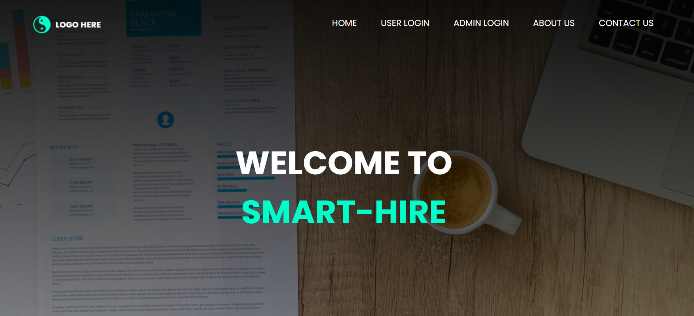
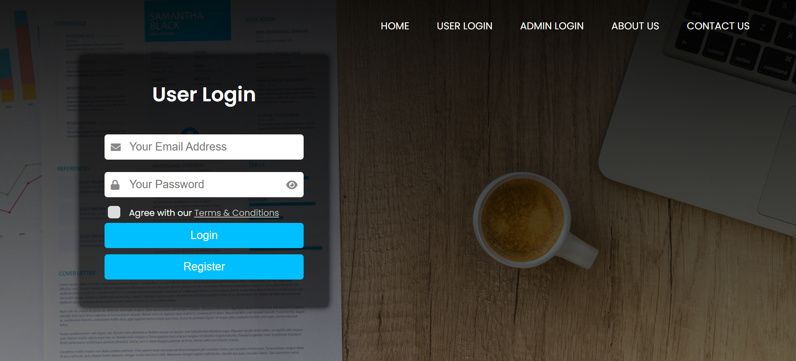
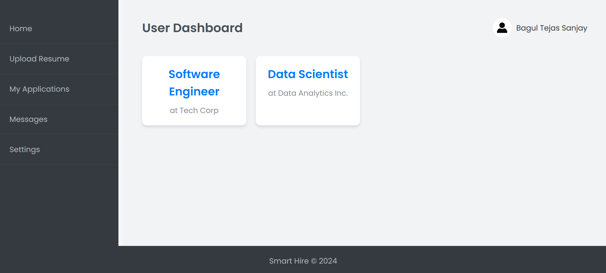
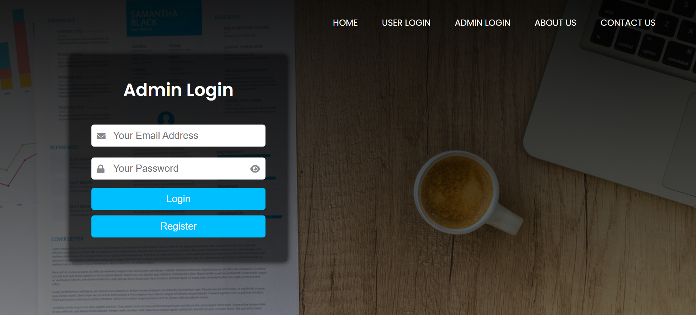
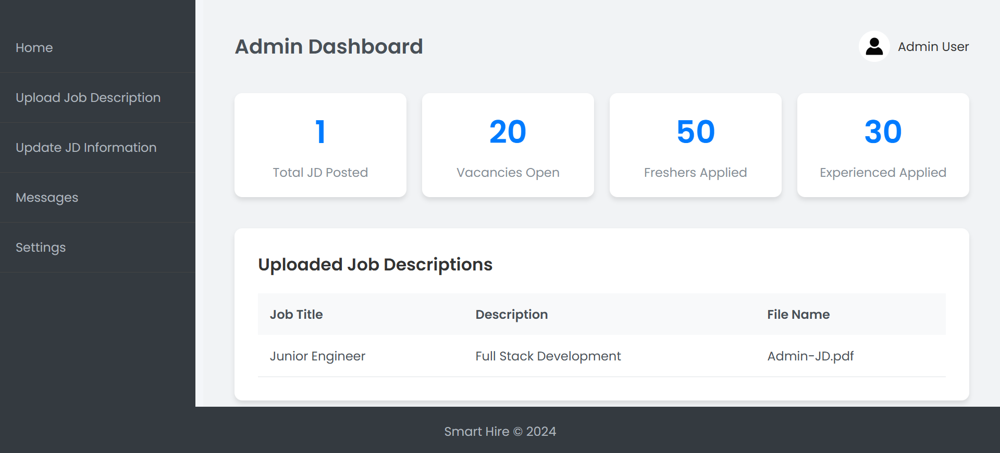
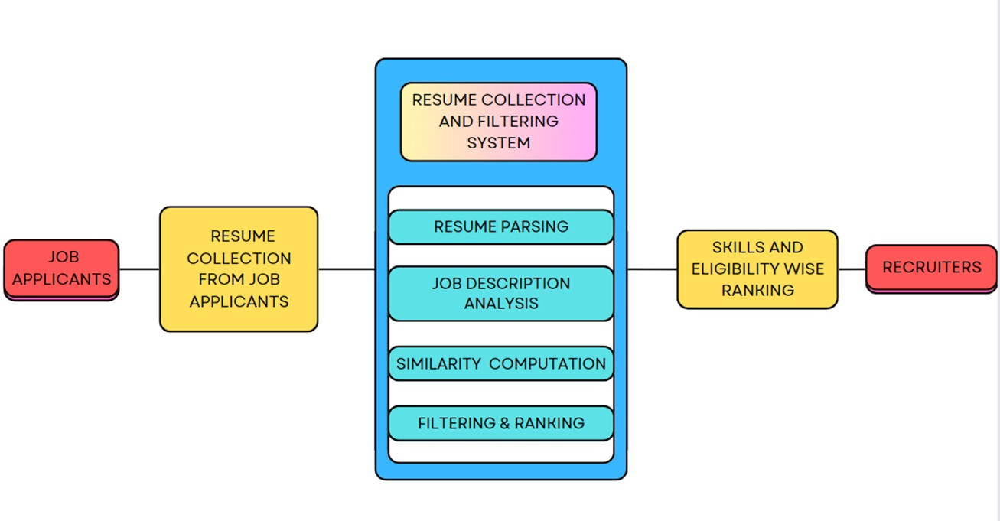

# 🚀 AI-Powered Resume Screening and Ranking System

An Intelligent Talent Acquisition Platform engineered with a decoupled Next.js frontend and Python/Flask backend. It uses TF-IDF to automatically rank resumes against job descriptions.
---

## 🔑 Key Features

- ✅ **Role-Based Authentication**: Secure login system for applicants and recruiters.
- 📄 **Resume Upload & Parsing**: Extract contact details, skills, education, and experience from uploaded resumes.
- 📋 **Job Description Management**: Recruiters can upload and manage job descriptions with file support.
- 🧠 **NLP-Powered Analysis**: Extract and preprocess resume and JD content using spaCy and NLTK.
- 📊 **Resume-JD Matching**: Score and rank candidates based on skill and content similarity using TF-IDF or BERT + Cosine Similarity.
- 🔍 **Detailed Match Insights**: Display matched skills, missing skills, and match score per applicant.
- 🧾 **Admin Dashboard**: Recruiter dashboard to manage uploaded JDs and view applicant matches.
- 👨‍💻 **User Dashboard**: Applicant dashboard to upload resume, view recommendations, and track applied jobs.

---

## 🛠️ Tech Stack

| Layer         | Technology            |
|---------------|------------------------|
| Backend       | Python, Flask          |
| Frontend      | HTML5, CSS3, Bootstrap, Jinja2 Templates |
| Database      | MongoDB (NoSQL)        |
| NLP           | spaCy, NLTK, scikit-learn |
| Resume Matching | TF-IDF / BERT + Cosine Similarity |

---

## 📂 Project Directory Structure

```
smart_hire/
├── app/
│   ├── templates/          # Jinja2 HTML templates
│   ├── static/             # CSS, JS, and assets
│   ├── routes/             # Route definitions
│   ├── models/             # DB model wrappers
│   ├── nlp/                # Resume/JD parsers & matchers
│   ├── forms/              # Flask-WTF forms
│   └── __init__.py         # App factory
├── components
├── hooks
├── lib
├── public
├── styles
├── requirements.txt        # Python dependencies
├── run.py                  # Application entry point
├── init_db.py              # MongoDB index initializer
└── README.md               # This documentation
```

---

## 💻 Setup Instructions

### 1. Prerequisites

- Python ≥ 3.8
- MongoDB (local or Atlas)
- `pip` (Python package installer)

### 2. Installation

```bash
# Clone the repo
git clone https://github.com/yourusername/smart-hire.git
cd smart-hire

# Create and activate virtual environment
python -m venv venv
source venv/bin/activate    # On Windows: venv\Scripts\activate

# Install dependencies
pip install -r requirements.txt

# Download NLP models
python -m spacy download en_core_web_sm
python -m spacy download en_core_web_md
```

### 3. Configuration

Create a `.env` file in the root:

```
SECRET_KEY=your_secret_key
MONGO_URI=mongodb://localhost:27017/smart_hire
```

---

## 🚀 Run the App

```bash
# Start MongoDB in a new terminal (if running locally)
mongod

# Start the Flask server
python run.py
```

Visit the app at: [http://localhost:5000](http://localhost:5000)

---

## 👤 Usage Guide

### For Applicants:

- Register and log in
- Upload resume (PDF or DOCX)
- View extracted resume details
- See personalized job recommendations

### For Recruiters:

- Register and log in
- Upload job descriptions (with file)
- View matched applicants and ranking
- Explore matching insights

---

## 🧠 Resume-JD Matching Algorithm

- **TF-IDF Vectorization**: Converts resume and JD into vector representations
- **Cosine Similarity**: Measures similarity between resume and JD
- **Optional**: Swap with BERT embeddings for better semantic matching
- Score displayed with skill overlap analysis

---

## 🖼️ Screenshots

> 📸 Add screenshots in a `screenshots/` folder and reference them here:

### 🏠 Home Page



### 👤 User Login



### 📝 User Dashboard



### 📄 Admin Login



### 📊 Admin Dashboard



### 📊 Block Diagram



---

## 🗃️ Database Collections

| Collection   | Key Fields |
|--------------|------------|
| `users`      | `_id`, `fullname`, `email`, `password` |
| `admins`     | `_id`, `fullname`, `email`, `password` |
| `resumes`    | `_id`, `user_id`, `file_name`, `file_path`, `extracted_details` |
| `jobs`       | `_id`, `job_title`, `company_name`, `location`, `admin_id`, `file_path` |
| `applications` | `_id`, `user_id`, `job_id`, `match_score`, `status` |

---

## 📌 Todo / Roadmap

- [x] Resume Upload and Parsing
- [x] JD Upload and Management
- [x] Role-based Auth System
- [x] Resume-JD Matching System
- [ ] Apply-to-Job System
- [ ] Candidate Application Tracker
- [ ] JD Parsing (Optional via EdenAI)
- [ ] Advanced BERT Matching Option

---


